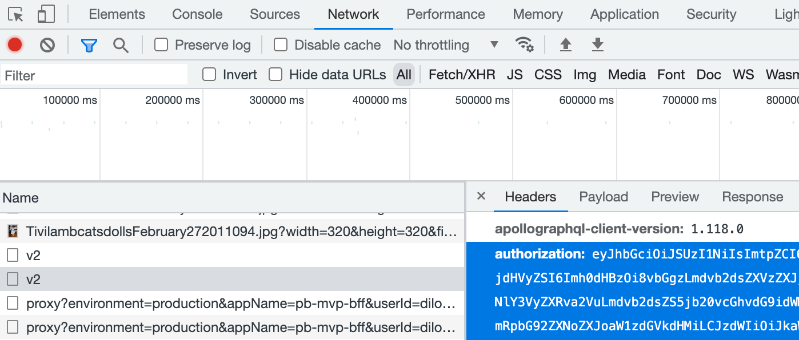

# phototap

This is a script to download an entire Photobucket album, since it's not possible through the website. It works for me running Python 3.9 on my MacBook as of 2023-02-09.

**I will not be maintaining this script.** It was written as a one-off solution before closing my Photobucket account. The script will likely get stale over time, but maybe it will help someone.

Install the requirements:

`pip install requests`

or

`pip install -r requirements.txt`

```
usage: phototap.py [-h] [--token TOKEN] [--count COUNT] [--album_id ALBUM_ID] [--out_dir OUT_DIR]

optional arguments:
  -h, --help           show this help message and exit
  --token TOKEN        The value of the Authorization header found from Chrome developer tools while browsing photobucket.com
  --count COUNT        The number of photos in the album
  --album_id ALBUM_ID  The UUID of the album from the URL when browsing the album on photobucket.com
  --out_dir OUT_DIR    The output directory for the photos
```

## How do I find the album ID?

1. Browse to your album on photobucket.com
1. Copy the UUID from the last part of the URL (for example, "a1c6a86d-b532-48f7-afff-93006c765371")

## How do I find the token?

1. Browse to your album on photobucket.com
1. In Chrome, click the hamburger menu (three dots) in the top right, then "More Tools", then "Developer Tools"
1. In the Developer Tools window, navigate to the Network tab
1. Scroll through your album a bit until you see a network request with the name "v2" and select it. Make sure the "Request Method" says "POST" and not "OPTIONS".
1. In the Headers tab to the right, find the "authorization" header under "Request Headers" and copy the entire value (it's pretty long)



## Does it support multiple albums?

No, you'll have to do them one by one or code something up yourself.
